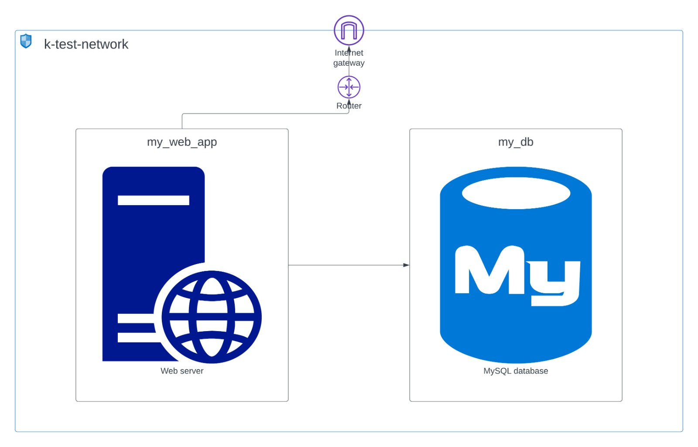
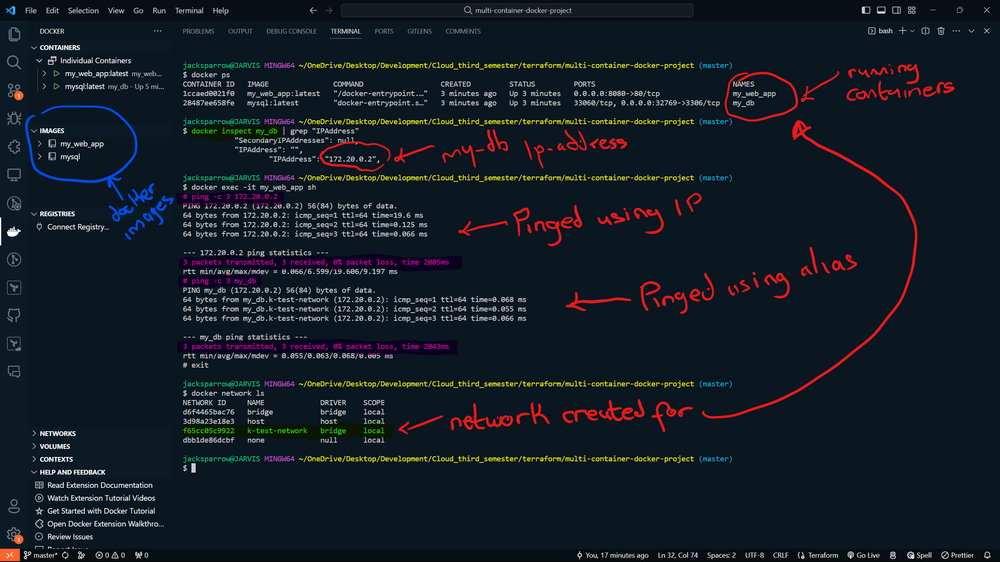

# Multi-Container Setup with Networking

## Table of Contents

- [1. Introduction](#1-introduction)
- [2. Setup](#2-setup)
  - [2.1. Prerequisites](#21-prerequisites)
  - [2.2. Architecture](#22-architecture)
  - [2.3. Running the Project](#23-running-the-project)
- [3. Testing](#3-testing)
- [4. Clean Up](#4-clean-up)
- [5. References](#5-references)
- [6. Author](#6-author)
- [7. Contributing](#7-contributing)
- [8. Conclusion](#8-conclusion)


## 1. Introduction

This guide demonstrates a basic multi-container setup with networking. It showcases a simple web application served by an Nginx web server, interacting with a MySQL database. The web app, built with HTML, CSS, and JavaScript, utilizes the Nginx image as a base, while the database relies on MySQL.

The primary goal is to illustrate how to set up a multi-container application with networking using Terraform. Keep in mind that this example is for educational purposes and not intended for production use. Success is achieved when the two Docker containers effectively communicate.

## 2. Setup

### 2.1. Prerequisites

- Docker
- Terraform

### 2.2. Architecture

The project's architecture is shown below:



### 2.3. Running the Project

1. Clone the repository.
2. Go to the project's root directory.
3. Create a file named `terraform.tfvars` in the root directory with the required variables:

    ```terraform
    project_name=""
    web_app_image=""
    db_image=""
    app_names=""
    mysql_config=""
    ```

    **Note:** `app_names` is a list(string) variable, and `mysql_config` is a map(string) variable. Provide `mysql_config` in this format:

    ```terraform
    mysql_config = {
        MYSQL_ROOT_PASSWORD = ""
        MYSQL_DATABASE = ""
        MYSQL_USER = ""
        MYSQL_PASSWORD = ""
    }
    ```

    The `app_names` variable should look like:

    ```terraform
    app_names = ["web_app", "db"]
    ```

4. Run these commands:

    ```bash
    terraform init
    terraform validate
    terraform plan -var-file="terraform.tfvars"
    terraform apply
    ```

5. Access the web application at `http://localhost:8080`.

## 3. Testing

After applying the Terraform configuration, the web application should be accessible at [http://localhost:8080](http://localhost:8080). It should connect to the database successfully and display data.


To verify the connection between the containers, run the commands in the image below:



The image confirms successful communication between the web application and the database.

## 4. Clean Up

To clean up, run:

```bash
terraform destroy -auto-approve
```

**Note:** Ensure the containers are stopped before running the `terraform destroy` command.

## 5. References

- [Docker](https://www.docker.com/)
- [Terraform](https://www.terraform.io/)
- [Nginx](https://www.nginx.com/)

## 6. Author

[Hamed A. A.](https://www.github.com/Hamed-Ayodeji)

## 7. Contributing

Contributions, issues, and feature requests are welcome!

To contribute, fork the repository, make changes, and push them back by creating a pull request. I will review and merge if satisfactory.

## 8. Conclusion

In conclusion, this project provides a simple example of setting up a multi-container application with networking.

Terraform is used to deploy the Docker containers locally. Success is achieved when the two Docker containers communicate effectively, this is achieved by placing both containers on the same network.
